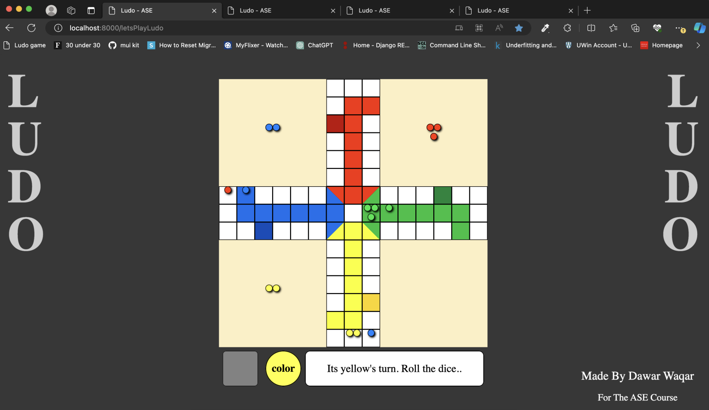

# Ludo

A funfilled multiplayer board game called Ludo made for extra credit for a course. I used JavaScript, WebSocket and CSS to develop this.



## Rules of the game

- https://www.youtube.com/watch?v=xYXj9DwKHr4
- https://en.wikipedia.org/wiki/Ludo

## Quick Start Tutorial

### Clone the repository

```
git clone https://github.com/DawarWaqar/Ludo.git
```

```
cd Ludo
```

### Install dependencies

```
npm install
```

### Run server

```
node serverLudo.js
```

### Go to the following URL on the browser

```
http://localhost:8000/letsPlayLudo
```

### Enjoy :)
